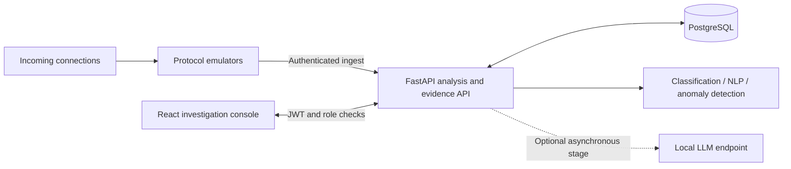

<div align="center">

# HoneySentinel AI

### Capture the interaction. Understand the behavior. Follow the evidence.

An AI-assisted honeypot platform with protocol emulation, encrypted session evidence,
and a workspace for investigating suspicious activity.

**[Quick start](#quick-start) · [Investigation workspace](#investigation-workspace) · [Architecture](#architecture) · [Development](#development) · [Deployment](DEPLOY.md)**

</div>

**[Live demo](https://honeypot-ui-psi.vercel.app) · [API docs](https://honeysentinel-api.onrender.com/docs)**


*Desktop preview using synthetic test data. The screenshot demonstrates the interface, not live threat activity.*

## What you can do

| Workflow | Capabilities |
|---|---|
| **Capture** | SSH, FTP, HTTP and HTTPS emulators record interactions and attempted credentials. |
| **Investigate** | Search sessions, filter by protocol and time, inspect transcripts, and review ATT&CK mappings. |
| **Connect** | Find related sessions through shared source IPs, URLs, domains and file hashes, with a reason for each match. |
| **Recover** | Queue completed captures across API outages and restarts, retry without duplicate sessions, and monitor delivery health. |
| **Understand** | Classification, anomaly detection, command analysis, research-scanner attribution, and optional LLM enrichment. |
| **Respond** | Triage alerts, manage nodes, review indicators, and control the honeypot through role-restricted actions. |
| **Share** | Copy an investigation link or export matching sessions as CSV, JSON, CEF, or STIX. |
| **Trace** | Backend commands, transcripts and credentials are encrypted at rest; privileged operations and evidence access are audit-logged where implemented. Engine capture files require protected storage. |

## Quick start

For the complete local stack, install **Docker Engine with Compose v2**, **Git**, and **Python 3**.
Docker builds the application dependencies for you.

```bash
git clone https://github.com/mandoof1/honeypot-ui.git
cd honeypot-ui
./start.sh
```

The startup script creates `.env` when absent and generates separate signing,
encryption, and ingest secrets. Compose starts PostgreSQL, the API, frontend, and engine.
The local Compose configuration enables demo seeding for an empty database.

| Service | Local address |
|---|---|
| Dashboard | http://localhost:5173 |
| Interactive API documentation | http://localhost:8000/docs |
| API health | http://localhost:8000/health |
| SSH / FTP emulation | `localhost:2222` / `localhost:2121` |
| HTTP emulation | http://localhost:8080 |

Retrieve the generated demo admin credentials from the backend startup log:

```bash
docker compose logs backend
```

Keep those credentials private. To stop the stack while retaining its named volumes:

```bash
./stop.sh
```

**Exposure matters:** Compose publishes the emulated service ports on the host.
Use an isolated development machine or network and review port bindings before starting.
HTTPS emulation is supported by the engine but is not enabled in the default protocol list.

## Investigation workspace

1. **Narrow the activity.** Search an address, session UUID, or command summary. Combine
   protocol, country, category, status, anomaly, scanner, and date filters.
2. **Read the evidence.** Select a session to inspect its verdict, tools, transcript, and
   ATT&CK mappings. Desktop uses a standing detail panel; mobile opens an accessible dialog.
3. **Share the context.** **Copy link** preserves filters, page, and selected session for
   another signed-in teammate. Date controls use local time; links use UTC timestamps.
4. **Export the matches.** Download records across all matching pages, with the same filters
   applied by the API. Analyst or administrator access is required.

| Export | Best suited to |
|---|---|
| CSV | Spreadsheet summaries; formula-like cells are neutralized. |
| JSON | Structured session reports and analysis. |
| CEF | SIEM ingestion and event processing. |
| STIX | Threat-intelligence interchange. |

Exports include at most the **newest 5,000 matching sessions**. The UI explicitly reports
truncation, and the API returns `X-Export-Count` and `X-Export-Truncated` headers.
Narrow the date window when an export reaches the limit.

Searches cancel superseded requests, downloads recover expired access tokens, and
**Refresh** reloads the current investigation. Research scanners can be excluded from
views without deleting their recorded activity.

## Architecture

**Related activity and delivery recovery:** see the [feature and operations guide](docs/CAPTURE_AND_CORRELATION.md)
for evidence matching, capture limits, queue monitoring and upgrade order.
The session detail panel reports omitted evidence when capture limits are reached.



| Layer | Stack |
|---|---|
| Console | React 19 · Vite 8 · Tailwind CSS 4 · Leaflet |
| API | Python 3.12 · FastAPI · SQLAlchemy 2 · Pydantic |
| Storage | PostgreSQL 16 · Alembic migrations |
| Analysis | scikit-learn · spaCy · optional local LLM |
| Engine | asyncio · AsyncSSH · protocol emulators |

The engine runs on an internal Docker network with dropped capabilities and a read-only
root filesystem. Deployment configuration supplies the actual isolation controls;
the engine's security checks report whether those controls are present.

## Model and data limitations

This is a capstone platform, **not a validated production detection system**.

- Without trained artifacts, the classifier and anomaly detector use synthetic bootstrap
  models. Confidence scores are not evidence of measured detection accuracy.
- Geolocation requires a MaxMind database. Missing data stays unknown.
- Behavioral clustering needs a fitted model; LLM enrichment needs a configured endpoint.
- In-memory rate limiting applies per process. Multiple workers need a shared limiter.
- Emulated services remain distinguishable from real systems through some behaviors.

See the [technical reference](docs/TECHNICAL_REFERENCE.md) for the analysis pipeline,
security model, API routes, and detailed limitations. See [model training](backend/ml/README.md)
for evaluation and dataset caveats.

## Development

Use **Node.js 24** and **Python 3.12** for the checked development environment.

### Frontend

```bash
npm ci
npm run dev
```

The default API URL is `http://localhost:8000/api/v1`. Set `VITE_API_URL` before building
when your backend is elsewhere. Frontend-only startup does not create an API or database.

### Backend and tests

```bash
python3.12 -m venv .venv
.venv/bin/pip install -r backend/requirements-test.txt -r honeypot/requirements.txt
.venv/bin/python -m pytest backend/tests -q
.venv/bin/python -m pytest honeypot/tests -q
```

Tests use isolated SQLite and do not require production credentials or a live engine.
For a manually run backend, configure PostgreSQL and the secrets described in
[`.env.example`](.env.example), then run migrations and Uvicorn from `backend/`.
See [deployment instructions](DEPLOY.md) for service configuration.

```bash
npm run check                   # Lint, API-client tests, production build
npx playwright install chromium
npm run test:e2e                 # Desktop/mobile browser tests of the built app
```

Browser tests use synthetic API fixtures; they do not replace testing a deployed stack.
Route-level lazy loading keeps the map and other page bundles out of the initial download.

**CI configuration:** [docs/ci.yml.example](docs/ci.yml.example) contains the complete
GitHub Actions workflow. To activate it, copy it to `.github/workflows/ci.yml` using
GitHub's editor or a token with `workflow` permission. It is a template here because
the publishing token does not grant that permission; no CI status is implied.

## Configuration and deployment

Start with [`.env.example`](.env.example). The key settings are:

| Setting | Purpose |
|---|---|
| `SECRET_KEY` / `ENCRYPTION_KEY` | Separate signing and encryption secrets. |
| `HONEYPOT_INGEST_TOKEN` | Matching service credential on API and engine. |
| `DATABASE_URL` / `DATABASE_URL_SYNC` | Runtime and migration database connections. |
| `CORS_ORIGINS` | Allowed frontend origins. |
| `VITE_API_URL` | Frontend API endpoint, including `/api/v1`. |
| `GEOIP_DB_PATH` | Optional MaxMind database path. |
| `CHIMERA_URL` | Optional local model endpoint. |

| Guide | Use it for |
|---|---|
| [Deployment](DEPLOY.md) | Hosting the console, API, database, and standalone engine. |
| [Standalone node](deploy/node/) | Running an engine on a separate VM. |
| [Client integration](CLIENT_INTEGRATION.md) | Connecting components and consuming the API. |
| [Technical reference](docs/TECHNICAL_REFERENCE.md) | Security controls, API inventory, and analysis internals. |

The standalone engine needs a host that accepts the required raw TCP ports. A web-only
hosting service is insufficient for SSH and FTP capture.

## Troubleshooting

| Symptom | Check |
|---|---|
| “Cannot reach the API” | Backend health, `VITE_API_URL`, and allowed CORS origins. |
| Startup rejects configuration | Replace placeholder secrets and check database settings. |
| Empty map | Confirm sessions have coordinates and GeoIP data is installed. |
| Export controls missing | Viewer accounts cannot export; use an analyst/admin account. |
| Only some records exported | Check the truncation notice and narrow the filters. |
| Engine unreachable | Check container health, the control URL, and matching ingest tokens. |

## Contributing

For changes: use a feature branch, describe the behavior before and after, and run the
checks relevant to the change. Use synthetic fixtures in tests and screenshots.
Never commit `.env` files, access tokens, or captured credentials.

## License

MIT — see [LICENSE](LICENSE).
