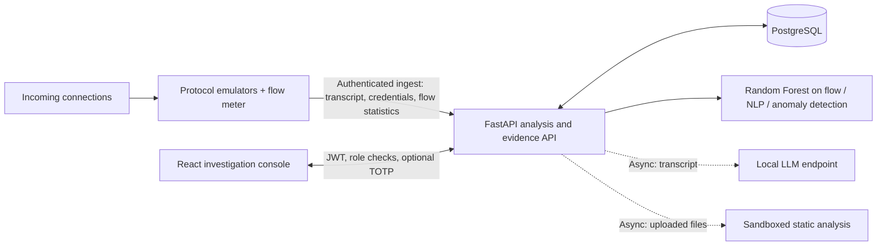

<div align="center">

# HoneySentinel AI

### Capture the interaction. Understand the behavior. Follow the evidence.

An AI-assisted honeypot platform with protocol emulation, encrypted session evidence,
and a workspace for investigating suspicious activity.

**[Quick start](#quick-start) · [Self-hosted deployment](#self-hosted-deployment) · [Evaluation](#evaluation) · [Architecture](#architecture) · [Development](#development)**

</div>

**[Live demo](https://honeypot-ui-psi.vercel.app) · [API docs](https://honeysentinel-api.onrender.com/docs)**


*Desktop preview using synthetic test data. The screenshot demonstrates the interface, not live threat activity.*

## What you can do

| Workflow | Capabilities |
|---|---|
| **Capture** | SSH, FTP, HTTP and HTTPS emulators record interactions, attempted credentials (shell, FTP, web login forms and HTTP Basic auth), files attackers upload, and each connection's flow statistics. Passive mode records without answering, on every protocol. |
| **Investigate** | Search sessions, filter by protocol and time, inspect transcripts (shell commands, FTP commands and HTTP requests with their bodies), and review ATT&CK mappings. |
| **Understand** | A Random Forest trained on CIC-IDS2017, anomaly detection, command analysis, research-scanner attribution, and optional LLM enrichment. |
| **Reverse-engineer** | Uploaded files are analysed statically — never run — for type, capabilities, embedded indicators, and a malware-family hint. |
| **Respond** | Triage alerts, manage nodes, review indicators, and control the honeypot through role-restricted actions. |
| **Share** | Copy an investigation link or export matching sessions as CSV, JSON, CEF, or STIX. |
| **Trace** | Captured evidence is encrypted at rest; privileged operations and evidence access are audit-logged where implemented. |
| **Secure access** | Role-based accounts, with optional TOTP two-factor sign-in that each user enrols from Settings by scanning a QR code. |

## Quick start

For the complete local stack, install **Docker Engine with Compose v2**, **Git**, and **Python 3**.
Docker builds the application dependencies for you.

```bash
git clone https://github.com/mandoof1/honeypot-ui.git
cd honeypot-ui
./start.sh
```

The startup script creates `.env` when absent and generates separate signing,
encryption, and ingest secrets. Compose starts PostgreSQL, the API, frontend, and engine.
The local Compose configuration enables demo seeding for an empty database.

| Service | Local address |
|---|---|
| Dashboard | http://localhost:5173 |
| Interactive API documentation | http://localhost:8000/docs |
| API health | http://localhost:8000/health |
| SSH / FTP emulation | `localhost:2222` / `localhost:2121` |
| HTTP / HTTPS emulation | http://localhost:8080 / https://localhost:8443 |

Retrieve the generated demo admin credentials from the backend startup log:

```bash
docker compose logs backend
```

Keep those credentials private. To stop the stack while retaining its named volumes:

```bash
./stop.sh
```

**Exposure matters:** this local stack publishes the emulated services on `127.0.0.1`
only, and its engine can still open outbound connections. Do not expose it. For a
deployment that faces the internet, use [the self-hosted deployment](#self-hosted-deployment),
which drops the engine's outbound traffic at the host firewall.

## Self-hosted deployment

[`deploy/server/`](deploy/server/README.md) runs the whole system on one Linux machine:
database, API, dashboard and engine. This is how the project's own server runs it.

```bash
sudo git clone https://github.com/mandoof1/honeypot-ui.git /opt/honeysentinel
sudo bash /opt/honeysentinel/deploy/server/install.sh
```

The installer is idempotent, and sets up:

- **Secrets and transport.** Random secrets in a root-only `.env`, and a TLS
  certificate that Postgres requires for every connection.
- **Containment.** The database, API and ingest service sit on internal Docker
  networks with no route out, and the dashboard proxy is published on loopback only.
  The decoys' bridge accepts connections, and a systemd unit that runs before Docker
  drops anything the engine tries to open.
- **Throughput.** A separate four-worker `ingest` service analyses sessions, so a
  burst does not queue behind the dashboard's API.
- **Operations.** Nightly database backups, and the dashboard served over
  Tailscale HTTPS.
- **Accounts.** An administrator account is created directly. The demo seed is
  never used, so no synthetic session sits beside captured traffic.

Scripts beside it cover the rest of the lifecycle:

| Script | Does |
|---|---|
| `train-model.sh` | Fetch and verify CIC-IDS2017, train the classifier with tuning, install it and restart the API |
| `controlled-test.sh` | End-to-end check against a throwaway engine named `controlled-test-node`, so test traffic never mixes with real captures |
| `stress-test.sh` | The NFR-2 / TC13 load test: N concurrent sessions, then the latency measured for each |
| `backup.sh` | The nightly `pg_dump`, on demand |

## Evaluation

Measured on the reference server (8 cores) on 2026-10-05. Every figure comes
from a JSON file in [`docs/evaluation/`](docs/evaluation/README.md).

**Stage-1 classifier.** Random Forest on CIC-IDS2017, using 2,391,461 flows after
de-duplication. Hyperparameters were chosen on a validation split, and the model
was tested once on a held-out 20% (478,293 flows).

| | precision | recall | F1 |
|---|---|---|---|
| benign | 0.998 | 0.998 | 0.998 |
| exploitation | 0.995 | 0.992 | 0.993 |
| reconnaissance | 0.988 | 0.999 | 0.993 |
| exfiltration (397 test flows) | 0.469 | 0.824 | 0.598 |

Accuracy is 0.9967 and macro F1 is 0.896. 0.23% of benign flows were flagged
as attacks, and one prediction takes 9 ms. Exfiltration is the weak class: it
is Bot and Infiltration traffic, about 2,000 flows in all.

**NFR-2 (classification within 200 ms of session end).**

| load | classified within 200 ms | session end → verdict stored (p50 / max) |
|---|---|---|
| one session at a time | 100% | 33 ms / 43 ms |
| 10 concurrent | 100% | 38 ms / 138 ms |
| 20 concurrent | 100% | 55 ms / 337 ms |
| 500 at once | 82% | 4.2 s / 8.0 s, all 500 captured |

The requirement holds up to 10 concurrent sessions on this host. Past that,
sessions queue for CPU.

## Investigation workspace

1. **Narrow the activity.** Search an address, session UUID, or command summary. Combine
   protocol, country, category, status, anomaly, scanner, and date filters.
2. **Read the evidence.** Select a session to inspect its verdict, tools, transcript, and
   ATT&CK mappings. Desktop uses a standing detail panel; mobile opens an accessible dialog.
3. **Share the context.** **Copy link** preserves filters, page, and selected session for
   another signed-in teammate. Date controls use local time; links use UTC timestamps.
4. **Export the matches.** Download records across all matching pages, with the same filters
   applied by the API. Analyst or administrator access is required.

| Export | Best suited to |
|---|---|
| CSV | Spreadsheet summaries; formula-like cells are neutralized. |
| JSON | Structured session reports and analysis. |
| CEF | SIEM ingestion and event processing. |
| STIX | Threat-intelligence interchange. |

Exports include at most the **newest 5,000 matching sessions**. The UI explicitly reports
truncation, and the API returns `X-Export-Count` and `X-Export-Truncated` headers.
Narrow the date window when an export reaches the limit.

Searches cancel superseded requests, downloads recover expired access tokens, and
**Refresh** reloads the current investigation. Research scanners can be excluded from
views without deleting their recorded activity.

## Architecture


```mermaid
flowchart LR
    Traffic[Incoming connections] --> Engine[Protocol emulators + flow meter]
    Engine -->|Authenticated ingest: transcript, credentials, flow statistics| API[FastAPI analysis and evidence API]
    API <--> DB[(PostgreSQL)]
    UI[React investigation console] <-->|JWT, role checks, optional TOTP| API
    API --> Analysis[Random Forest on flow / NLP / anomaly detection]
    API -. Async: transcript .-> LLM[Local LLM endpoint]
    API -. Async: uploaded files .-> Payload[Sandboxed static analysis]
```

| Layer | Stack |
|---|---|
| Console | React 19 · Vite 8 · Tailwind CSS 4 · Leaflet |
| API | Python 3.12 · FastAPI · SQLAlchemy 2 · Pydantic |
| Storage | PostgreSQL 16 · Alembic migrations |
| Analysis | scikit-learn · spaCy · optional local LLM · static payload analysis (pyelftools, pefile) |
| Engine | asyncio · AsyncSSH · protocol emulators |

The engine runs with dropped capabilities and a read-only root filesystem, and it
talks to the API only over an internal Docker network. Docker will not publish ports
for a container whose only network is internal, so the decoy ports sit on a separate
bridge. In the self-hosted deployment, the host firewall drops every connection the
engine tries to open from that bridge. The engine's isolation check verifies this by
actually trying to connect out, rather than inferring it from the routing table.

The engine measures every connection at its socket (`honeypot/capture/flow.py`):
payload bytes and data packets in each direction, the largest packet each way, and
inter-arrival times. For SSH this is below the encryption. These are the
classifier's inputs, defined once and shared by training and inference.

## Model and data limitations

This is a capstone platform, **not a validated production detection system**.

- The trained classifier (86 MB) is not committed; `deploy/server/train-model.sh`
  produces it. Without it, the API falls back to a synthetic bootstrap model and labels
  every verdict `model_source: "synthetic"`. The anomaly detector is still a synthetic
  bootstrap.
- The classifier's scores are measured on CIC-IDS2017 flows. The engine sees what its
  sockets deliver, not packets on the wire, so how well it transfers to live honeypot
  traffic is an assumption. No real internet traffic has been captured yet.
- NFR-2 holds up to about 10 concurrent sessions on the reference host, not under
  arbitrary load (see [Evaluation](#evaluation)).
- Geolocation needs a MaxMind GeoLite2 or DB-IP City Lite database; the self-hosted
  installer fetches DB-IP's and credits it on the map. Missing data stays unknown.
- Behavioral clustering needs 50+ captured sessions to fit; LLM enrichment needs a
  configured endpoint.
- In-memory rate limiting applies per process, so the dashboard API runs as one
  process. The multi-worker ingest service carries no user-facing rate limits.
- Payload analysis is static and heuristic — it never runs a sample, so it misses
  runtime-only behaviour, and its malware-family label is a hint with evidence, not a verdict.
- Emulated services remain distinguishable from real systems through some behaviors.

See the [technical reference](docs/TECHNICAL_REFERENCE.md) for the analysis pipeline,
security model, API routes, and detailed limitations. See [model training](backend/ml/README.md)
for evaluation and dataset caveats.

## Development

Use **Node.js 24** and **Python 3.12** for the checked development environment.

### Frontend

```bash
npm ci
npm run dev
```

The default API URL is `http://localhost:8000/api/v1`. Set `VITE_API_URL` before building
when your backend is elsewhere. Frontend-only startup does not create an API or database.

### Backend and tests

```bash
python3.12 -m venv .venv
.venv/bin/pip install -r backend/requirements-test.txt
.venv/bin/python -m pytest backend/tests -q
```

Tests use isolated SQLite and do not require production credentials or a live engine.

```bash
.venv/bin/pip install -r honeypot/requirements.txt pytest pytest-asyncio
.venv/bin/python -m pytest honeypot/tests -q     # engine: emulators, capture, flow metering
```
For a manually run backend, configure PostgreSQL and the secrets described in
[`.env.example`](.env.example), then run migrations and Uvicorn from `backend/`.
See [deployment instructions](DEPLOY.md) for service configuration.

```bash
npm run check                   # Lint, API-client tests, production build
npx playwright install chromium
npm run test:e2e                 # Desktop/mobile browser tests of the built app
```

Browser tests use synthetic API fixtures; they do not replace testing a deployed stack.
Route-level lazy loading keeps the map and other page bundles out of the initial download.

**CI configuration:** [docs/ci.yml.example](docs/ci.yml.example) contains the complete
GitHub Actions workflow. To activate it, copy it to `.github/workflows/ci.yml` using
GitHub's editor or a token with `workflow` permission. It is a template here because
the publishing token does not grant that permission; no CI status is implied.

## Configuration and deployment

Start with [`.env.example`](.env.example). The key settings are:

| Setting | Purpose |
|---|---|
| `SECRET_KEY` / `ENCRYPTION_KEY` | Separate signing and encryption secrets. |
| `HONEYPOT_INGEST_TOKEN` | Matching service credential on API and engine. |
| `DATABASE_URL` / `DATABASE_URL_SYNC` | Runtime and migration database connections. |
| `CORS_ORIGINS` | Allowed frontend origins. |
| `VITE_API_URL` | Frontend API endpoint, including `/api/v1`. |
| `GEOIP_DB_PATH` | Optional MaxMind GeoLite2 or DB-IP City Lite database path. |
| `HONEYPOT_PROTOCOLS` | Emulators to run: any of `ssh,ftp,http,https`. |
| `HONEYPOT_OPERATIONAL_MODE` | Starting mode, `active` or `passive`; a mode saved in Settings takes precedence once the engine registers. |
| `CHIMERA_URL` | Optional local model endpoint. |

| Guide | Use it for |
|---|---|
| [Self-hosted deployment](deploy/server/README.md) | The whole system on one machine you control; the reference deployment. |
| [Deployment](DEPLOY.md) | Hosting the console, API, database, and standalone engine separately. |
| [Model training](backend/ml/README.md) | Features, training, tuning, and the caveats to state when quoting results. |
| [Evaluation](docs/evaluation/README.md) | Classifier metrics and NFR-2 load-test results, with the raw JSON. |
| [Standalone node](deploy/node/) | Running an engine on a separate VM. |
| [Client integration](CLIENT_INTEGRATION.md) | Connecting components and consuming the API. |
| [Technical reference](docs/TECHNICAL_REFERENCE.md) | Security controls, API inventory, and analysis internals. |

The standalone engine needs a host that accepts the required raw TCP ports. A web-only
hosting service is insufficient for SSH and FTP capture.

## Troubleshooting

| Symptom | Check |
|---|---|
| “Cannot reach the API” | Backend health, `VITE_API_URL`, and allowed CORS origins. |
| Startup rejects configuration | Replace placeholder secrets and check database settings. |
| Empty map | Confirm sessions have coordinates and GeoIP data is installed. |
| Export controls missing | Viewer accounts cannot export; use an analyst/admin account. |
| Only some records exported | Check the truncation notice and narrow the filters. |
| Engine unreachable | Check container health, the control URL, and matching ingest tokens. |
| Lost the authenticator app | Enter one of the recovery codes in the sign-in code field. Each works once. |
| Mode saved but "engine could not be reached" | The engine adopts the saved mode the next time it registers, at startup. |
| `model_source: "synthetic"` on verdicts | No trained model is installed; run `deploy/server/train-model.sh`. |

## Contributing

For changes: use a feature branch, describe the behavior before and after, and run the
checks relevant to the change. Use synthetic fixtures in tests and screenshots.
Never commit `.env` files, access tokens, or captured credentials.

## License

MIT — see [LICENSE](LICENSE).
