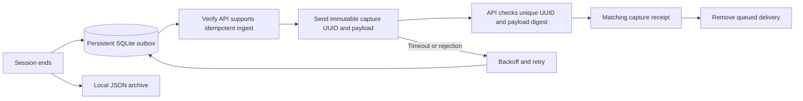

# Reliable capture and related activity

Completed captures now survive API outages in a local delivery queue. Analysts
can follow recorded evidence from one session to related sessions, with the
reason for each match shown in the investigation panel.

## Delivery lifecycle



- The outbox lives at `HONEYPOT_CAPTURE_DIR/delivery.sqlite3`, on the same
  persistent volume as the archives. A committed entry survives an engine
  restart. SQLite uses full synchronous transactions; its filesystem work
  runs outside the protocol event loop.
- A single sender loads one queued payload at a time. It checks the
  token-protected `/sessions/ingest-capabilities` route before sending, so an
  older API that ignores capture UUIDs cannot accumulate duplicates from retries.
- The backend uses the engine's UUID as `session_uuid`. Its existing unique
  index arbitrates concurrent requests. A SHA-256 digest checks that repeat
  requests contain the same evidence and belong to the same node. A mismatch
  returns `409` and never overwrites the original record.
- A repeat receipt contains `session_id`, `session_uuid`, `duplicate: true`,
  and the stored classification summary. It does not rerun analysis, create
  new IOCs or alerts, write another ingest audit, or schedule enrichment.
  The initial response retains the detailed analysis and adds `duplicate: false`.
- Retries use exponential backoff with jitter, up to 360 seconds. A numeric
  `Retry-After` may extend the delay, up to one hour. Transport failures,
  throttling and server outages pause the sender, preventing a large backlog
  from repeatedly hitting an unavailable API. Other rejected records wait
  five minutes while eligible records continue.
- Node registration is retried and never defaults to node 1. Once a queued
  capture has a node ID, that ID is pinned across restarts. If the backend node
  is deleted, the capture stays pending; its evidence is not silently assigned
  to another node.
- Capture start and end timestamps describe the interaction, even when the
  API receives it much later. An ambiguous receipt is safe to retry.
- Graceful shutdown waits for capture persistence, including SSH disconnect
  tasks, then stops delivery. Cancelling an in-flight send leaves its row
  queued for the next startup.

The authenticated engine status and backend `/api/v1/honeypot/status` expose
`delivery.pending`, `retrying`, `oldest_pending_seconds`, `max_attempts`,
`last_error`, and `capture_errors`. The last counter covers persistence errors
since process start. The console shows the pending count and failures. If the
queue cannot be read, its size is reported as unknown, never as zero.

## Capture limits

Limits apply when evidence enters memory, before a session finishes.

| Evidence | Retained per session |
|---|---|
| Command/output pairs | First 500; at most 4,096 characters in each command and output |
| Attempted credentials | First 200; 128 characters per username and password |
| Network events | First 200; shared 8,192-character value budget and 64-value budget per event, bounded nesting and keys |
| Keystrokes | First 1,024 entries; the total observed count is still sent |
| Uploaded files | At most 50 entries and 16 MiB total content |
| Download records | At most 50 entries |

Omitted entries and clipped command, output, credential and event text have
`capture_dropped` counters in the archive, ingest payload and session response.
The detail panel labels incomplete evidence. Completed records are released
from the engine's session cache after persistence; the total session counter
remains available. HTTP header dictionaries remain captured within the event
budget, and event details cannot overwrite timestamps or event types.

These are **per-session evidence limits**, not a complete denial-of-service
defence. Existing connection rate limits and deployment isolation still matter.
The outbox and archives consume disk space; there is no automatic archive
retention or queue size quota. Monitor the capture volume. Successful delivery
deletes the queued row, but SQLite can retain freed pages for reuse.

New capture archives, uploaded files and the outbox are created with owner-only
file permissions. **Engine files contain unencrypted evidence, including
attempted credentials.** Restrict and protect the capture volume and its
backups. Backend command/transcript/credential encryption remains unchanged.
Queue errors never include HTTP response bodies that might echo credentials.

Disk failure can prevent capture persistence. The engine reports the failure
and attempts the local archive even when enqueueing fails; such an archive may
require manual recovery. Active sessions are not periodically checkpointed, so
an abrupt process or host failure can lose interactions that have not ended.
Existing JSON archives from older engine versions are not automatically replayed.

## Investigating related activity

Open a session and choose **Find related activity**. The panel returns the
newest matching sessions, across nodes and protocols, and explains each match:

- **Same source IP:** exact equality of the recorded source addresses.
- **Shared indicator:** exact equality of both type and stored value for a
  URL, domain or file hash. Repeated indicators within a session count once.

Tool names and filenames do not establish a relation. No credentials are
decrypted for this search. Shared infrastructure and shared exit addresses are
possible; a match does not prove a common attacker or campaign. This feature
does not require a trained model or change the classifier's provenance.

Choose a window of ±1, ±7 or ±30 days around the selected session's start,
and optionally hide attributed research scanners. The search is independent
of the current list filters, allowing a related HTTP session to be found from
an SSH investigation. Opening a match preserves list filters and pagination;
Back returns to the earlier session. Superseded requests are cancelled and a
failed related search can be retried without discarding the selected evidence.

`GET /api/v1/sessions/{id}/related` requires a signed-in user and accepts:

| Parameter | Default | Bounds |
|---|---|---|
| `window_days` | 7 | 1–30, before and after the anchor |
| `limit` | 20 | 1–50 |
| `exclude_scanners` | false | Boolean |

The response includes the exact window, `matches`, `truncated`, and
`indicators_truncated`. Each match contains its session, `same_source_ip`, up
to five `shared_indicators`, and `shared_indicator_count`. The query uses at
most 100 distinct seed indicators, ordered by type and value. Both result
limits are disclosed in the interface; the endpoint does not claim a total
campaign size. Values are matched as stored, without case or URL normalization.

## Upgrade and validation

1. Back up the database and the engine's capture volume.
2. Deploy the backend and apply Alembic revision **007** (normally through
   startup migrations). It adds nullable `ingest_digest` and `capture_dropped`
   columns, a session time index and an IOC lookup index. Existing records and
   UUIDs remain intact; legacy ingest without `capture_id` remains supported.
3. Deploy the engine with its existing persistent capture volume, backend URL,
   ingest token and node identity. The SSH and backend dependency sets now
   agree on `cryptography==48.0.1`, satisfying AsyncSSH 2.24's requirement.
4. Deploy the frontend. Verify engine status and confirm pending deliveries
   drain after a controlled test capture. Do not remove the queue file to
   clear an error; it holds evidence awaiting delivery.

For rollback, stop the updated engine before downgrading the API. Preserve its
outbox for a later compatible engine. Revision 007 can be downgraded to 006,
but that removes the new metadata and idempotency digest.

```bash
.venv/bin/pip install -r backend/requirements-test.txt -r honeypot/requirements.txt
.venv/bin/python -m pytest backend/tests -q
.venv/bin/python -m pytest honeypot/tests -q
npm ci
npm run check
npm run test:e2e
```

For the PostgreSQL integration test, set `TEST_POSTGRES_URL` to an available
test database using the `postgresql+asyncpg://` driver and run
`backend/tests/test_delivery_postgres.py`. It creates its own temporary schema,
applies 001–007, rolls 007 back and reapplies it with legacy data present,
then forces two concurrent submissions through the unique-UUID race. The test
removes its schema afterward. Without this variable, that one test is skipped.

Tests use synthetic evidence. They exercise local failure recovery and browser
behaviour; they do not establish live attack capture or model accuracy.
